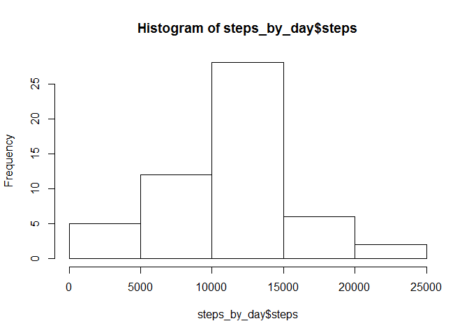
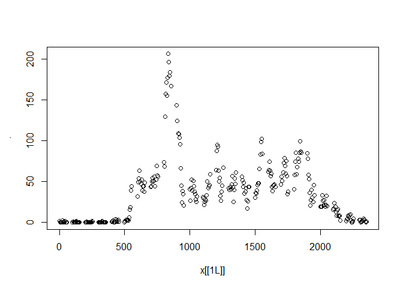
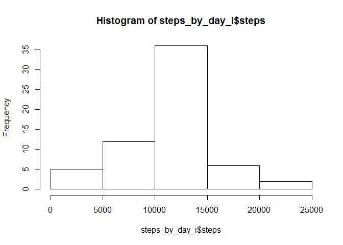

# Reproducible Research: Assignment 1
## by M.Crossland

## Loading and preprocessing the data
Load the activity.csv file, convert text value of date to dates

```r
thedata <- read.csv("activity.csv")
thedata$date <- as.Date(thedata$date)
thedata$steps <- as.numeric(thedata$steps)
thedata2 <- thedata
thedata <- na.omit(thedata)
```

## What is mean total number of steps taken per day?
Calculate the mean steps per day, excluding missing values

```r
mean(thedata$steps, na.rm=TRUE)
```

```
## [1] 37.3826
```
Calculate the median steps per day, excluding missing values

```r
median(thedata$steps, na.rm=TRUE)
```

```
## [1] 0
```
Histogram of steps per day

```r
steps_by_day <- aggregate(steps ~ date, thedata, sum)
hist(steps_by_day$steps)
```

<!-- -->

## What is the average daily activity pattern?


```r
library(reshape2)
```

```
## Warning: package 'reshape2' was built under R version 3.3.2
```

```r
md = melt(thedata, id=c("date", "interval"))
IntMean = dcast(md, interval~md$steps, mean)
plot(IntMean, IntMean$steps)
```

<!-- -->


## Counting and Imputing missing values

### Number of missing values

```r
sum(is.na(thedata2$steps))
```

```
## [1] 2304
```

### Impute data for missing values

Missing values were derived by calculating the average for each interval.  

```r
steps_by_interval <- aggregate(steps ~ interval, thedata2, mean)
imputed_data <- transform(thedata2, steps = ifelse(is.na(thedata2$steps), steps_by_interval$steps[match(thedata2$interval, steps_by_interval$interval)], thedata2$steps))
summary(imputed_data)
```

```
##      steps             date               interval     
##  Min.   :  0.00   Min.   :2012-10-01   Min.   :   0.0  
##  1st Qu.:  0.00   1st Qu.:2012-10-16   1st Qu.: 588.8  
##  Median :  0.00   Median :2012-10-31   Median :1177.5  
##  Mean   : 37.38   Mean   :2012-10-31   Mean   :1177.5  
##  3rd Qu.: 27.00   3rd Qu.:2012-11-15   3rd Qu.:1766.2  
##  Max.   :806.00   Max.   :2012-11-30   Max.   :2355.0
```
### Histogram with imputed data

```r
steps_by_day_i <- aggregate(steps ~ date, imputed_data, sum)
hist(steps_by_day_i$steps)
```

<!-- -->

### Calculate new mean and media for imputed data set

```r
mean(steps_by_day_i$steps)
```

```
## [1] 10766.19
```

```r
median(steps_by_day_i$steps)
```

```
## [1] 10766.19
```

## Are there differences in activity patterns between weekdays and weekends?


```r
weekdays <- c("Monday", "Tuesday", "Wednesday", "Thursday", 
              "Friday")
imputed_data$dow = as.factor(ifelse(is.element(weekdays(as.Date(imputed_data$date)),weekdays), "Weekday", "Weekend"))

steps_by_interval_i <- aggregate(steps ~ interval + dow, imputed_data, mean)

library(lattice)

xyplot(steps_by_interval_i$steps ~ steps_by_interval_i$interval|steps_by_interval_i$dow, main="Average Steps per Day by Interval",xlab="Interval", ylab="Steps",layout=c(1,2), type="l")
```

<!-- -->
